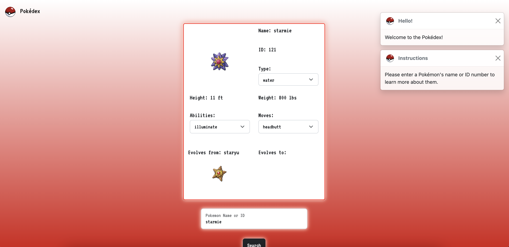

# Pokédex

Web Development Tools Used: Javascript, HTML/CSS

Framework: [Bootstrap](https://getbootstrap.com/)

APIs Used: [PokéApi](https://pokeapi.co/)

This program allows users to search for a Pokémon by typing either its name or its assigned ID number. 

The Pokédex displays information about the Pokémon that is being requested. 

*Information displayed in for the Pokémon are as follows:
  *Name
  *ID
  *Type
  *Height
  *Weight
  *Abilities
  *Moves
  *Evolves from
  *Evolves to

